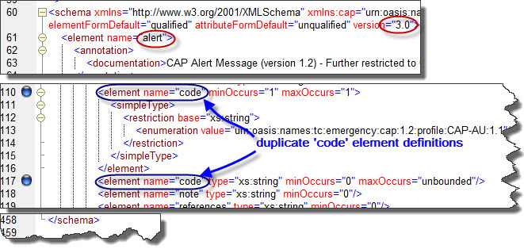
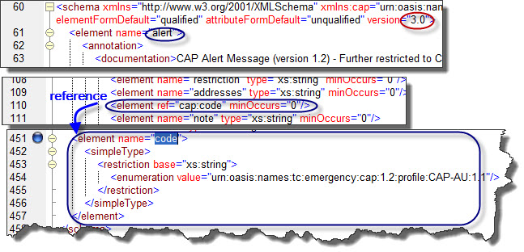

# CAP-au
Idea, finding, issue and note of CAP-au (Common Alerting Protocol - Australia)

## Schemas set 
The officicial home page of CAP-au is [1] and its Schemas set (XSD) ver 3.0 is available from [2].

### Issue with the schemas setver 3.0
Duplicate definitions of Element 'code' - at line#110 and #117 is causing ill-formedness, as shown in the screenshot below.

 

This means that it cannot be used any further. On the contrary, CAP ver 1.2 [3] doesn't present such issue.

#### The resolution
See screenshot for an easy resolution.
 

#### What if ...
Should we raise the issue to the authority who can correct the anomaly?

### Fully expanded schemas set diagram
Before the the resolution is implemented offcially, at least we can have a bird-eye view of the schemas set through a 
. 

## Semantics rules
Judged by the report from Google-hosted CAP validator, there appears some set of semantics rules, which I used to call cross-element checking rules - on top structural rules already governed by affore-mentioned schemas set. 

If the semantics rules meant to exist, where are they? 

#### What if ...
If they are not existial yet, should the custodian be sitting down with individual domain expert to find out semantics rules of each event?

# Reference
[1] https://data.gov.au/dataset/cap-au-std 
[2] https://data.gov.au/dataset/cap-au-std/resource/137e98ce-f069-48ca-a420-274afc4ad78c 
[3] https://github.com/google/cap-library/blob/master/schema/cap12_extended.xsd
[4] https://cap-validator.appspot.com/
